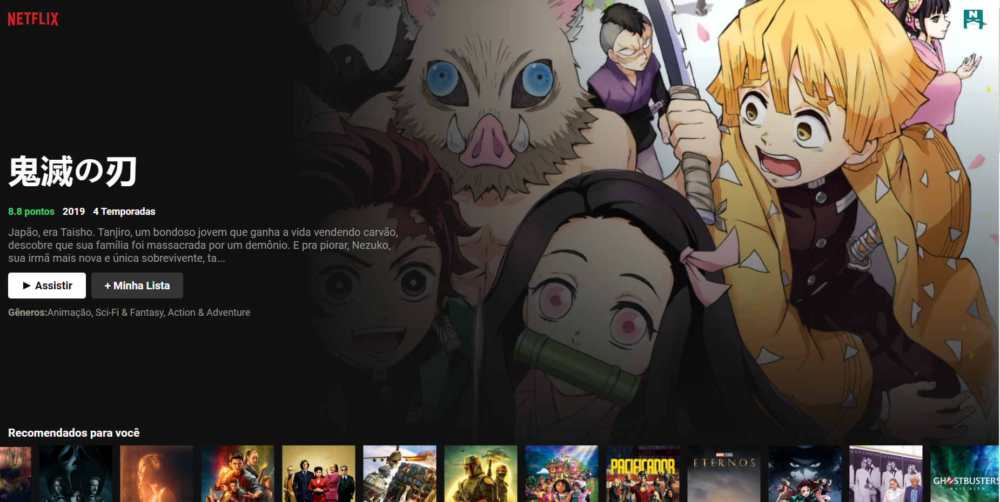
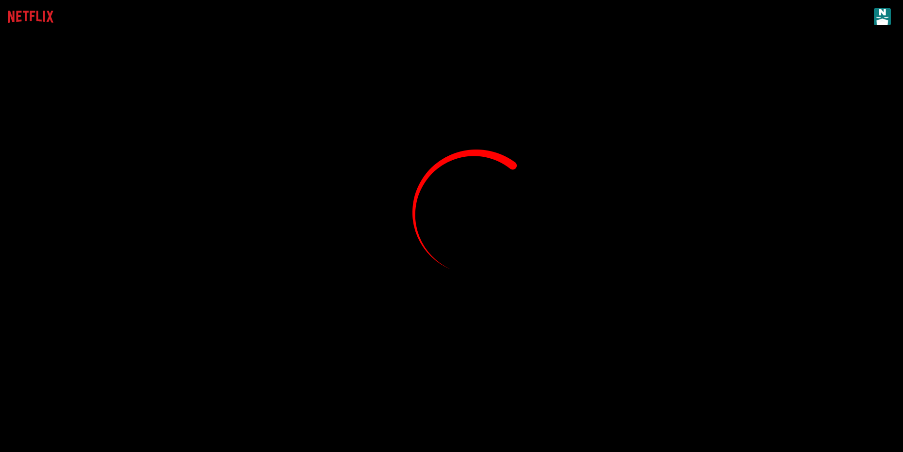
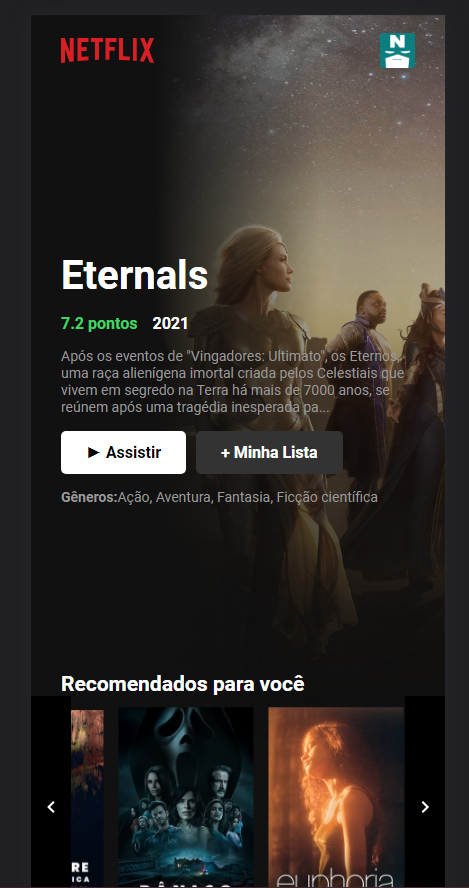
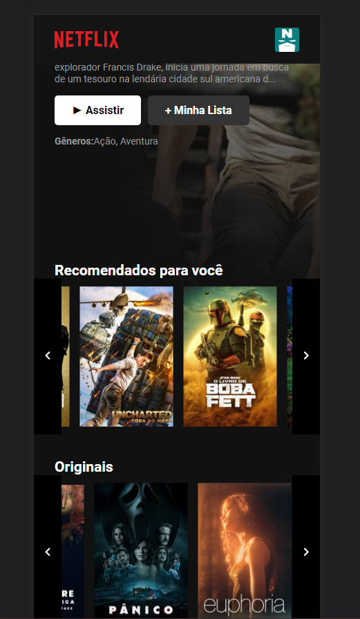

[Aplicação CloneFlix](https://wellytonsdj.github.io/cloneFlix/)

# **CLONEFLIX**

## **Overview**

Depois de ter encontrado uma API bacana que me trazia descrição, ano, capa e vários outros dados de filmes e séries resolvi criar essa Web Aplication visando simular a aplicação da Netflix.

 * Toda estilização foi feita com puro css.
 * A API utilizada foi [The Movie DB](https://www.themoviedb.org/u/Well989?language=pt-BR).
---
 ## **Sobre a experiência:**

 Durante a criação, encontrei problemas com a API, mas, ao invés de deixá-la de lado e tentar outra que funcionasse melhor, decidi corrigir o máximo que pudesse para ter mais um desafio durante a criação.
 
 Lembrando que deixei o arquivo da API separado, como forma de deixar prático a troca em caso de troca futura ou facilitar manutenção/correção.

 
 
 
 

 ---
 ## **Componentes**

 ### Header
 Header trasparente que ao ser dado scroll na página, fica escuro para não atrapalhar a experiência entre os botões e os itens da lista.
 
 ### Feature Movie
 Sempre que recarregada a página, troca para outro filme/série das listas. Mostra o nome original, avaliação, ano de exibição, genero e em caso de série mostra quantas temporadas tem.

 ### Lista
Irá listar os filmes daquela coleção, seja por categoria ou genero.
Quando colocado mouse sobre a lista, mostra os botões avançar e voltar para ver os outros itens na lista.

### Responsividade
Quando em um aparelho mobile, as fontes são otimizadas para não atrapalhar a experiência e os botões da lista ficam ativos o tempo todo

### Loading
Caso a requisição demore, aparecerá uma animação de 'carregando' enquanto não aparecem os componentes prontos.

---
## Desafios resolvidos:
Toda a criação do Layout foi um desafio, mas, houveram algumas partes que deram mais trabalho, resolvi destacar algumas:

### *Dados corrompidos na API*
 Como a API moviedb não estava funcionando as seções 'tv networks' nem os 'movies' (não só essas partes como outras mas ) que serviriam para puxar os filmes em categorias diferentes, como 'terror', ação' ou 'comédia' por exemplo. Repliquei os dados que estavam funcionando, por isso há repetições de dados em todas listas.

### *Nomenclatura diferente para itens iguais* 
A API possui nomenclatura diferente para vários items.

Por exemplo:
* quando é um arquivo que se encaixava em Filmes, ela busca o nome como original_name, e quando Série ela buscava original_title.
* quando era um filme ele puxa 'release' e quando era série 'first_air_date'.

Utilizei condicionais para checar e fazer a troca sempre que necessário.

### *Descrição estourando tamanho*
Quando me refiro a 'estourar tamanho' quero dizer que, no filme em destaque, quando a descrição era muito grande ela quebrava todo o layout.
Para consertar isso, utilizei o método 'substring'

### *Botões avançar e voltar na lista*
Para o botão voltar, a lógica não foi dificil, pois ao chegar a 0 item na lista foi só criar um algoritmo para parar o funcionamento do botão.
Mas para avançar deu muito trabalho!!
Confesso que não fiz tudo de cabeça, mas consegui resolver.

Primeiro fiz a parte de avançar, e até aí tudo bem. O primeiro problema foi que ele ficaria indo ao infinito e além!
Para resolver criei um IF:
Primeiro tive que pegar tamanho total da lista, vezes o tamanho cada item, se a diferença da tela da tela do usuário e do tamanho da lista for maior que X VOLTE PARA o tamanho da tela menos a lista. 
Aqui veio o segundo problema, não estava encaixando o tamanho ainda, mas depois de quebrar a cabeça descobri que precisava diminuir 60 que era o padding para a direita (30) e para a esquerda(30). 

E assim foi resolvido!
É isso, espero que tenham curtido! 

Até mais!😄

